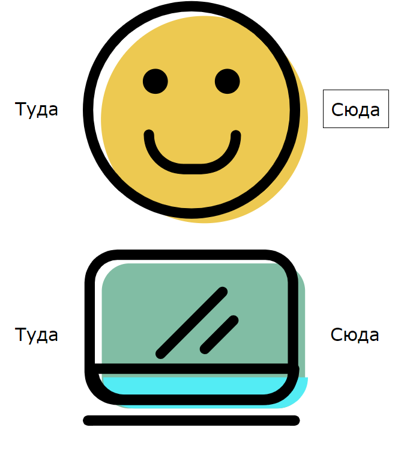

# Слайдер ООП



# HTML

```html

<div class="sliders slider1">
  
  
  
  
  
  
  

  <div class="switch">
    <a href="#" class="prev">Туда</a>
    <a href="#" class="next">Сюда</a>
  </div>

</div>

<div class="sliders slider2">
  
  
  
  
  
  
  

  <div class="switch">
    <a href="#" class="prev">Туда</a>
    <a href="#" class="next">Сюда</a>
  </div>

</div>

```


# slider JS

```js

function Sliders(obj) {
  this.images = document.querySelectorAll(obj.images);

  this.auto = obj.auto;

  this.btnPrev = obj.btnPrev;
  this.btnNext = obj.btnNext;

  this.rate = obj.rate || 2000;

  let i = 0;

  let slider = this;

  this.prev = function () {
    slider.images[i].classList.remove('active');
    i--;

    if (i < 0) i = slider.images.length - 1;

    slider.images[i].classList.add('active');

  };

  this.next = function () {
    slider.images[i].classList.remove('active');
    i++;

    if (i >= slider.images.length) i = 0;

    slider.images[i].classList.add('active');

  };

  document.querySelector(slider.btnPrev).onclick = slider.prev;
  document.querySelector(slider.btnNext).onclick = slider.next;

  if (slider.auto) setInterval(slider.next, slider.rate)

}

```

# script JS

```js

window.onload = function () {


  new Sliders({
    images: '.slider1 img',
    btnPrev: '.slider1 .switch .prev',
    btnNext: '.slider1 .switch .next',
    auto: true,
    rate: 3000
  });

  new Sliders({
    images: '.slider2 img',
    btnPrev: '.slider2 .switch .prev',
    btnNext: '.slider2 .switch .next',
    auto: false
  });


};

```
